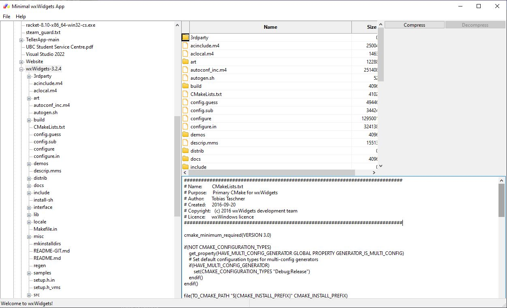
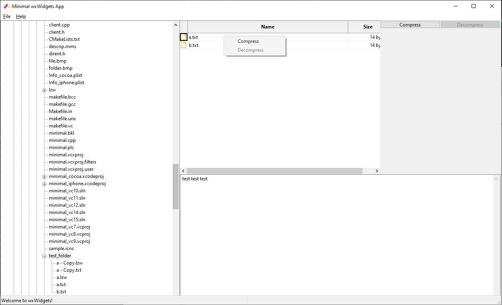
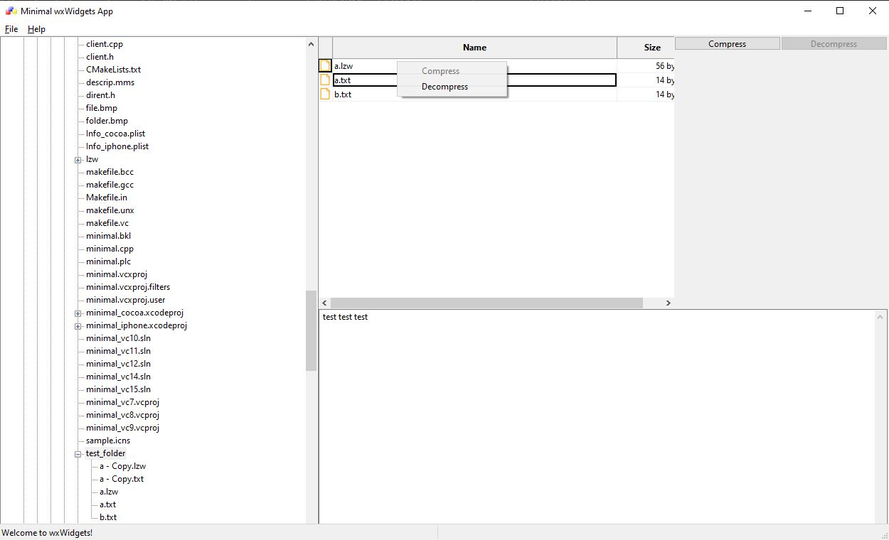

# File Viewer and Compressor
A file viewer that can be used to compress and decompress certain files

Overview
------------

This application is a file viewer, such as the file explorer in Windows, with some added features. The user is able to see the content of files that they select, and they are able to compress and decompress them using Lempel-Ziv-Welch (lzw) compression.

How to Install
------------

 - First, install the wxWidgets library. We will be using the installer for version 3.2.4 for this guide. 

 - Go into `wxWidgets-3.2.4\build\msw\wx_vc15.sln`, set the configuration(s) you would like to use, then right click the Solution and select `Build Solution`

 - Drag the files `minimal.cpp`, `client.cpp`, `client.h`, `dirent.h`, `file.bmp`, `folder.bmp`, `lzw.cpp`, `lzw.h` into `wxWidgets-3.2.4\samples\minimal`

 - Open `wxWidgets-3.2.4\samples\minimal\minimal_vc15.sln`, go into `Solution Explorer -> Show All Files`, then right click `lzw.cpp` and `lzw.h` and select `Include In Project`
 
How to use
-----

 - Open the project by going into `wxWidgets-3.2.4 -> samples -> minimal -> minimal_vc15.sln`

 - Using the tree in the leftmost window, navigate through your files and click on folders to expand the contents onto the upper window

 - In the upper window, select files to view its contents

 - Compress and decompress files by right clicking on a file and pressing the respective buttons

Creators
-----

Made by San Kang, with mentorship from Samil Chai.
This project was mostly made in 2019, with some revisions in 2024 for it to be uploaded on Github.